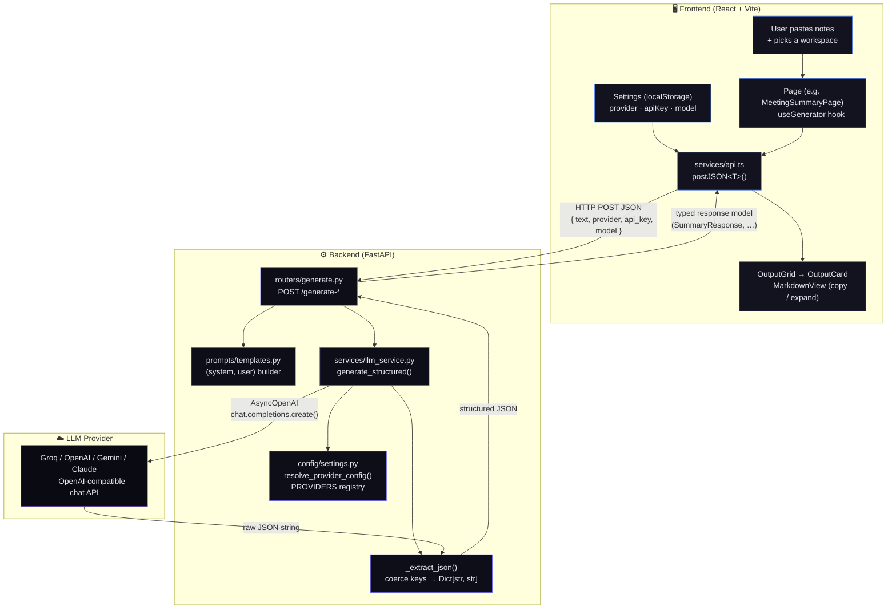
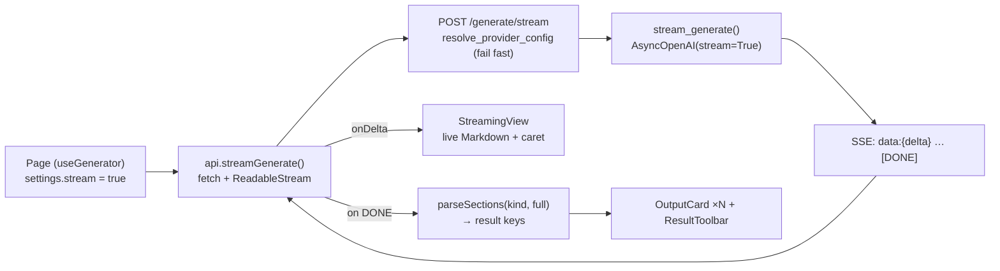
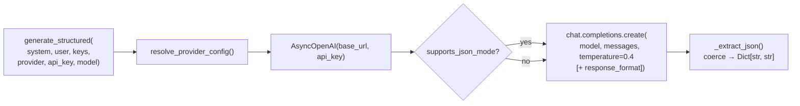
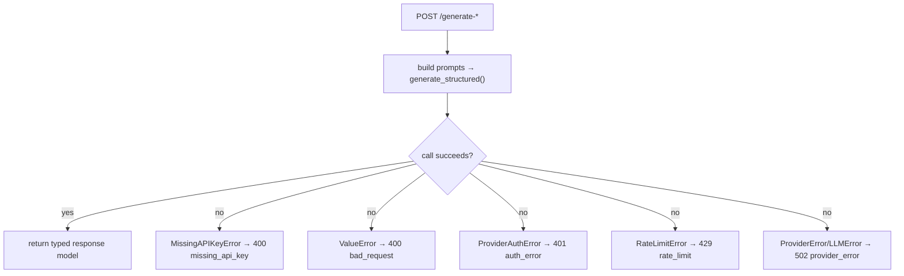

# Architecture — Vyasa

This document explains how Vyasa is put together: the end-to-end data flow, the
responsibilities of each component, the request/response shapes for all four generation
endpoints, the provider abstraction that lets one code path serve four LLM vendors, the
error-handling flow, and a folder map.

For setup and usage, see [README.md](README.md). For the exact internal prompt templates,
see [docs/sample-prompts.md](docs/sample-prompts.md).

---

## Overview

Vyasa is a two-tier local app:

- **Frontend** — a React 18 + TypeScript + Vite single-page app. It owns view switching,
  collects unstructured notes plus the user's provider/key/model settings, and renders the
  structured response as frosted-glass cards.
- **Backend** — a FastAPI service. It validates input, builds carefully engineered prompts,
  calls the chosen LLM through an OpenAI-compatible client, extracts a single JSON object
  from the model's reply, and returns it as a typed response.

There is **no database and no auth**. The API key and provider live in the browser
(`localStorage`) and travel with each request; the backend falls back to environment
variables only when the request omits them.

---

## Data flow

The core path is: **Frontend → FastAPI → LLM service → provider → structured JSON →
cards.**



**Step by step**

1. The user opens a workspace, pastes notes, and clicks **Generate**.
2. The page's `useGenerator` hook validates the text is non-empty, then calls the matching
   function in `services/api.ts`.
3. `api.ts` merges the current `AppSettings` into the body
   (`{ text, provider, api_key?, model? }`) and `POST`s JSON to the backend.
4. The FastAPI router (`routers/generate.py`) parses the request into a Pydantic model and
   builds a `(system_prompt, user_prompt)` pair via `prompts/templates.py`.
5. The router calls `generate_structured(...)` in `services/llm_service.py` with the
   prompts and the list of expected output `keys`.
6. The service calls `resolve_provider_config()` (`config/settings.py`) to pick the base
   URL, API key, and model, then sends the chat request through `AsyncOpenAI`.
7. The model replies with a JSON string. `_extract_json()` strips any code fences, isolates
   the JSON object, parses it, and coerces every expected key to a string (defaulting to
   `""`).
8. The router wraps the dict in the endpoint's typed response model and returns it.
9. `api.ts` resolves the typed result; the page renders it as `OutputCard`s with Markdown,
   copy, and expand/collapse.

---

## Component responsibilities

### Backend

| Module | Responsibility |
| --- | --- |
| `main.py` | Creates the `FastAPI` app, configures CORS from `FRONTEND_ORIGINS`, exposes `GET /`, `GET /health`, `GET /providers`, and mounts the generate router. |
| `config/settings.py` | Holds the `PROVIDERS` registry (base URL, default model, env key, JSON-mode flag), the `pydantic-settings` `Settings` singleton, and `resolve_provider_config()` which decides provider/key/model with env fallback. |
| `models/schemas.py` | Pydantic v2 request and response models — the typed contract for every endpoint, including `StreamRequest`, `ValidateRequest`/`ValidateResponse`, and `ErrorResponse`. |
| `prompts/templates.py` | The four JSON prompt builders (`(system, user)` tuples) + `KEYS`, plus the streaming Markdown prompt builder `stream_prompt()` + the `STREAM_HEADERS` map. |
| `routers/generate.py` | The four generation `POST` endpoints, the SSE `POST /generate/stream`, and `POST /validate-key`. Each builds prompts, calls the service, maps exceptions to HTTP errors, and returns the right response. |
| `services/llm_service.py` | The provider-agnostic calls: `generate_structured()`, `stream_generate()` (async delta iterator), `validate_credentials()` (zero-cost `models.list`), the `LLMError` hierarchy, and `_extract_json()`. |

### Frontend

| Area | Responsibility |
| --- | --- |
| `App.tsx` | Owns the active `ViewId`, `useSettings()`, `useHistory()`, and the restore flow; wraps everything in `ToastProvider`; renders `Layout`, the active page (in `AnimatePresence`), and `HistoryPanel`. |
| `components/Layout.tsx`, `Sidebar.tsx`, `Background.tsx` | App shell: animated gradient background, glass sidebar nav (incl. the History opener), and the scrollable main area. |
| `pages/*` | One thin page per workspace, each composing `Workspace` + `useGenerator` (streaming + history `onSuccess`) + output cards, with a restore effect. |
| `components/Workspace.tsx` | Shared page scaffold: header, optional `KeyNotice`, glass input panel (`NoteInput` + toolbar), Generate/Clear, and the output region (error / live `StreamingView` / loader / result + `ResultToolbar`). |
| `components/OutputGrid.tsx`, `OutputCard.tsx`, `MarkdownView.tsx`, `StreamingView.tsx` | Render structured results as staggered, copyable, collapsible Markdown cards — and the live token stream while generating. |
| `components/HistoryPanel.tsx`, `ResultToolbar.tsx`, `KeyNotice.tsx` | History drawer (restore/delete/clear), result actions (copy-all / export `.md` / regenerate), and the onboarding "no key set" banner. |
| `services/api.ts` | Typed `fetch` wrappers (`generateSummary`, `generateEmail`, `generateDailyReport`, `generateWeeklyReport`), `streamGenerate` (SSE reader), `validateKey`, `fetchProviders`, and the `postJSON<T>` helper. |
| `hooks/*` | `useLocalStorage`, `useSettings`, `useGenerator` (non-stream **and** streaming + `setData`/`regenerate`), `useClipboard`, `useHistory` (capped, persisted), `useToast` (`ToastProvider`). |
| `lib/*` | `motion` (variants), `sections` (per-kind `SECTIONS`/`parseSections`/`buildMarkdown`/`makeStream`), `download` (export), `time` (relative timestamps). |
| `types/index.ts` | Shared TypeScript types (incl. `GenKind`, `HistoryEntry`, `GeneratorPageProps`) and the `ApiError` class. |

---

## Request / response shapes

All four `POST` endpoints share these request fields:

```jsonc
{
  "text": "string (required, non-empty)",
  "provider": "groq | openai | gemini | claude   (optional)",
  "api_key": "string (optional — falls back to server env)",
  "model": "string (optional — falls back to provider default)"
}
```

Every response value is a **GitHub-flavored Markdown string**, empty (`""`) when a section
has no content.

### 1. `POST /generate-summary` — `SummaryRequest` → `SummaryResponse`

```jsonc
// request
{ "text": "...", "provider": "groq", "api_key": "...", "model": "..." }

// response
{
  "summary":      "string",
  "action_items": "string",
  "risks":        "string",
  "dependencies": "string",
  "next_steps":   "string"
}
```

### 2. `POST /generate-email` — `EmailRequest` → `EmailResponse`

The email request adds a `tone` field.

```jsonc
// request
{
  "text": "...",
  "tone": "professional | friendly | executive | concise",   // default "professional"
  "provider": "groq", "api_key": "...", "model": "..."
}

// response
{
  "subject": "string",
  "email":   "string"   // markdown body: greeting, body, call to action, [Your Name]
}
```

### 3. `POST /generate-daily-report` — `DailyReportRequest` → `DailyReportResponse`

```jsonc
// request
{ "text": "...", "provider": "groq", "api_key": "...", "model": "..." }

// response
{
  "completed":   "string",
  "in_progress": "string",
  "upcoming":    "string"
}
```

### 4. `POST /generate-weekly-report` — `WeeklyReportRequest` → `WeeklyReportResponse`

```jsonc
// request
{ "text": "...", "provider": "groq", "api_key": "...", "model": "..." }

// response
{
  "accomplishments":      "string",
  "challenges":           "string",
  "pending":              "string",
  "next_week_priorities": "string"
}
```

### Error response — `ErrorResponse`

```jsonc
{
  "error":  "string",   // short machine-ish summary
  "detail": "string",   // human-friendly explanation (may be "")
  "code":   "string"    // missing_api_key | bad_request | auth_error | rate_limit | provider_error
}
```

### 5. `POST /generate/stream` — `StreamRequest` → Server-Sent Events

A single endpoint covers all four `kind`s. Instead of JSON, the model is prompted for
Markdown with fixed `## ` section headers (see `STREAM_HEADERS`), streamed live, then the
frontend (`lib/sections.parseSections`) splits it back into the **same result keys** as the
non-streaming endpoints — so the cards are identical either way.

```jsonc
// request
{
  "kind": "summary | email | daily | weekly",
  "text": "...",
  "tone": "professional | …",   // used for kind=email
  "provider": "groq", "api_key": "...", "model": "..."
}

// response: Content-Type: text/event-stream
data: {"delta": "## Summary\n"}
data: {"delta": "The team shipped..."}
data: [DONE]

// on failure, instead of [DONE]:
event: error
data: {"error": "...", "detail": "...", "code": "provider_error"}
```

Credential/provider errors are validated **before** the stream opens, so missing-key and
unknown-provider cases still return a normal `400` (not an SSE frame).

### 6. `POST /validate-key` — `ValidateRequest` → `ValidateResponse`

Powers the Settings **Test Connection** button via a zero-cost `models.list()` call.

```jsonc
// request
{ "provider": "groq", "api_key": "...", "model": "..." }

// response (200)
{ "ok": true, "provider": "groq", "model": "llama-3.3-70b-versatile", "detail": "Connection successful." }
// invalid credentials map to the same error codes as the generation endpoints (400/401/429/502)
```

---

## Streaming flow



When `settings.stream` is `false`, the page uses the JSON endpoints instead; both paths end
at the same typed result and the same cards, and a successful run is recorded via the
`useGenerator` `onSuccess` callback into `useHistory`.

---

## Provider abstraction

Every supported provider exposes an **OpenAI-compatible** chat-completions API, so Vyasa
uses a single client (`AsyncOpenAI`) and swaps only the base URL, key, and model. The
registry lives in `config/settings.py`:

| `id` | `base_url` | `default_model` | `env_key` | `supports_json_mode` |
| --- | --- | --- | --- | :---: |
| `groq` | `https://api.groq.com/openai/v1` | `llama-3.3-70b-versatile` | `GROQ_API_KEY` | `True` |
| `openai` | `https://api.openai.com/v1` | `gpt-4o-mini` | `OPENAI_API_KEY` | `True` |
| `gemini` | `https://generativelanguage.googleapis.com/v1beta/openai/` | `gemini-2.0-flash` | `GEMINI_API_KEY` | `True` |
| `claude` | `https://api.anthropic.com/v1/` | `claude-sonnet-4-6` | `ANTHROPIC_API_KEY` | `False` |

**Resolution — `resolve_provider_config(provider, api_key, model)`**

1. **Provider** — uses the request value, else `settings.default_provider` (`groq`).
   Raises `ValueError` if the id isn't in `PROVIDERS`.
2. **API key** — uses the request value if non-empty, else the provider's env field (e.g.
   `settings.groq_api_key`). If still empty, raises `MissingAPIKeyError`.
3. **Model** — uses the request value if non-empty, else the provider's `*_MODEL` override
   if set, else `PROVIDERS[provider]["default_model"]`.

It returns `{ base_url, api_key, model, supports_json_mode, provider }`.

**Why JSON mode matters.** Providers with `supports_json_mode = True` are called with
`response_format={"type":"json_object"}`, which strongly constrains the model to emit a
single JSON object. Claude (`False`) is not, so Vyasa relies on the prompt's strict JSON
instruction plus the defensive `_extract_json()` parser. Either way, the service guarantees
a `Dict[str, str]` containing exactly the requested keys.



---

## Error-handling flow

Errors are raised as a typed hierarchy in `services/llm_service.py`, mapped to HTTP
responses in `routers/generate.py`, and surfaced in the UI as an `AlertCard`.

**Exception hierarchy**

```
LLMError (base)
├── MissingAPIKeyError   # no key in request or env
├── ProviderAuthError    # provider rejected the key
├── RateLimitError       # provider rate limit
└── ProviderError        # upstream failure or unparseable JSON
```

**Mapping (router → HTTP)**

| Exception | HTTP status | `code` |
| --- | --- | --- |
| `MissingAPIKeyError` | `400` | `missing_api_key` |
| `ValueError` (unknown provider) | `400` | `bad_request` |
| `ProviderAuthError` | `401` | `auth_error` |
| `RateLimitError` | `429` | `rate_limit` |
| `ProviderError` / `LLMError` | `502` | `provider_error` |

The router converts each exception into an `HTTPException` whose `detail` is an
`ErrorResponse`-shaped dict `{ error, detail, code }`.



**On the frontend**, `services/api.ts` translates failures into the `ApiError` class:

- A network/fetch failure becomes `new ApiError('Could not reach the server…', { status: 0, code: 'network' })`.
- A non-OK response is parsed and becomes `ApiError(detail.detail || detail.error || 'Request failed', { status, code })`.
- An empty-input guard in `useGenerator` raises `ApiError('Please paste some notes first.', code 'empty')` before any request.

The page renders the resulting `ApiError` in an `AlertCard` (with a retry affordance where
provided), so the user always sees a calm, human-readable message.

---

## Folder map

```
Vyasa/
├── README.md
├── ARCHITECTURE.md                 # (this file)
├── .gitignore
├── docs/
│   ├── sample-prompts.md
│   └── screenshots/.gitkeep
├── backend/
│   ├── main.py                     # app + CORS + /, /health, /providers + router
│   ├── requirements.txt
│   ├── .env.example
│   ├── config/
│   │   ├── __init__.py
│   │   └── settings.py             # PROVIDERS, Settings, resolve_provider_config
│   ├── models/
│   │   ├── __init__.py
│   │   └── schemas.py              # request/response models + ErrorResponse
│   ├── prompts/
│   │   ├── __init__.py
│   │   └── templates.py            # JSON builders + KEYS, stream_prompt + STREAM_HEADERS
│   ├── routers/
│   │   ├── __init__.py
│   │   └── generate.py             # generate / stream / validate-key + exception→HTTP mapping
│   └── services/
│       ├── __init__.py
│       └── llm_service.py          # generate_structured, stream_generate, validate_credentials
└── frontend/
    ├── package.json
    ├── vite.config.ts
    ├── tsconfig.json
    ├── tsconfig.node.json
    ├── tailwind.config.js
    ├── postcss.config.js
    ├── index.html
    ├── .env.example
    ├── .gitignore
    └── src/
        ├── main.tsx                # React 18 createRoot
        ├── App.tsx                 # view switching + Layout
        ├── index.css               # Tailwind + design system base
        ├── vite-env.d.ts
        ├── types/index.ts          # types (GenKind, HistoryEntry, …) + ApiError
        ├── services/api.ts         # typed fetch wrappers + streamGenerate + validateKey
        ├── lib/
        │   ├── motion.ts           # Framer Motion variants
        │   ├── sections.ts         # SECTIONS, parseSections, buildMarkdown, makeStream
        │   ├── download.ts         # client-side .md export
        │   └── time.ts             # relative timestamps
        ├── hooks/
        │   ├── useLocalStorage.ts
        │   ├── useSettings.ts
        │   ├── useGenerator.ts     # non-stream + streaming, setData, regenerate
        │   ├── useClipboard.ts
        │   ├── useHistory.ts
        │   └── useToast.tsx        # ToastProvider + useToast
        ├── components/
        │   ├── Background.tsx
        │   ├── Logo.tsx
        │   ├── Sidebar.tsx
        │   ├── Layout.tsx
        │   ├── GlassCard.tsx
        │   ├── GradientButton.tsx
        │   ├── Loader.tsx
        │   ├── AlertCard.tsx
        │   ├── NoteInput.tsx
        │   ├── MarkdownView.tsx
        │   ├── StreamingView.tsx
        │   ├── OutputCard.tsx
        │   ├── OutputGrid.tsx
        │   ├── ResultToolbar.tsx
        │   ├── ToneSelector.tsx
        │   ├── EmptyState.tsx
        │   ├── KeyNotice.tsx
        │   ├── HistoryPanel.tsx
        │   └── Workspace.tsx
        └── pages/
            ├── MeetingSummaryPage.tsx
            ├── EmailGeneratorPage.tsx
            ├── StatusReportsPage.tsx
            ├── WeeklyReportsPage.tsx
            └── SettingsPage.tsx
```
